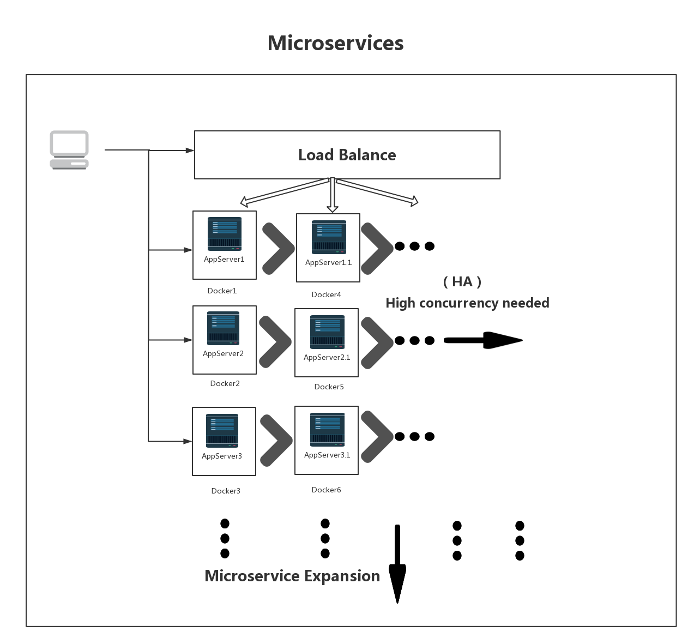
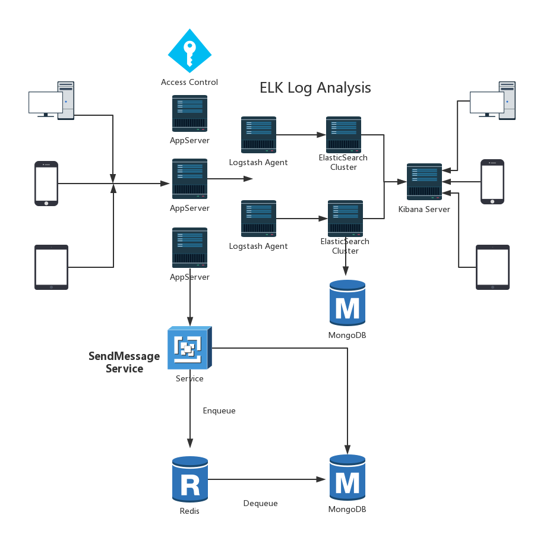

Email For Practice
====================

## Key Words
* [Microservices](https://www.martinfowler.com/articles/microservices.html)
* [Dotnet Core](https://dotnet.github.io/)
* [Restful](http://www.runoob.com/w3cnote/restful-architecture.html)
* [MongoDB](https://www.mongodb.com/download-center)
* [Redis](https://redis.io/)
* [ELK](https://www.elastic.co/)
* [Docker](https://www.docker.com/)


## Integrated Services Struct
* All of the logic for processing requests runs in a single process, allowing you to use basic language functions to divide your application into different categories, functions, and namespaces. For some reason, you can run and test your application on your developer's computer and use deployment pipelines to ensure that the various modifications are properly tested and deployed into production. With load balancers, you can scale out this gigantic application by running more instances.
* The update cycle is tightly bound - even a small part of the change in application requires the refactoring and deployment of the entire application. As time goes by, it is increasingly difficult to maintain a good modular architecture, with immediate impact. Once expanded, it must be scaled up as a whole, rather than merely expanding some of them, requiring more resources.


## Microservices Struct
* If the application breaks down into multiple services, it can be expected that a single service change may only need to be redeployed.
* Better support scales horizontally and vertically.


## ELK Struct
* Struct for ELK Log.



## Dotnet Core       
* .NET Core is a general purpose development platform maintained by Microsoft and the .NET community on GitHub. It is cross-platform, supporting Windows, macOS and Linux, and can be used in device, cloud, and embedded/IoT scenarios.

## Restful       
* Restful is a software architecture style, design style, rather than a standard, but provides a set of design principles and constraints. It is mainly used for client-server interaction software. Software designed based on this style can be more concise, more hierarchical, easier to implement mechanisms such as caching.

## MongoDB        
* MongoDB is a document database with the scalability and flexibility that you want with the querying and indexing that you need

## Redis      
* Redis is an open source (BSD licensed), in-memory data structure store, used as a database, cache and message broker. It supports data structures such as strings, hashes, lists, sets, sorted sets with range queries, bitmaps, hyperloglogs and geospatial indexes with radius queries. Redis has built-in replication, Lua scripting, LRU eviction, transactions and different levels of on-disk persistence, and provides high availability via Redis Sentinel and automatic partitioning with Redis Cluster.

## ELK
* Elasticsearch
	* An open source distributed search engine with features such as distributed, zero configuration, automatic discovery, automatic indexing, index copy mechanism, restful style interface, multiple data sources, automatic search load and more.
* Logstash
	* A completely open source tool that collects, analyzes, and stores your logs for later use
* Kibana 
	* An open source and free tool that analyzes the log of your Logstash and ElasticSearch friendly web interface to help you aggregate, analyze, and search for important data logs.

## Meta Data

```javascript
USE message
db.mailbox.insertOne(
{
  "Id": "E2A66291-7B16-CE3A-6F8D-0F194A8E08EE",
  "Name":"UserMailBox",
  "DisplayName":"UserMailBox",
  "UserName":"Joseph",
  "MaxSize":1099511627776,
  "AvailableSize":1099511627776,
  "LastUpdateTime": "2017:11:11 11:11:11:100"
})

db.folder.insertOne(
{
    "Id":"580A56AB-802F-2D44-EF05-09FF57C4FC30",
    "Name":"Inbox",
    "DisplayName":"Inbox",
    "Type":"InBox",
    "MessageCount":0,
    "MailBoxId":"E2A66291-7B16-CE3A-6F8D-0F194A8E08EE",
    "LastUpdateTime":"2017:11:11 11:11:11:100"
})

db.message.insertOne(
{
    "Id":"27C15195-0AD4-63CF-7DB4-6B65494E8111",
    "Subject":"HelloWorld",
    "Content":"How are you?",
    "SendTime":"2017:11:11 11:11:11:100",
    "State":"Unread",
    "FromAddress":"Joseph@Joseph.com",
    "ToAddress":"Peter@Joseph.com;Bill@Joseph.com",
    "CcAddress":"Tom@Joseph.com;Kathy@Joseph.com",
    "OriginalFolderId":"580A56AB-802F-2D44-EF05-09FF57C4FC30",
    "CurrentFolderId":"580A56AB-802F-2D44-EF05-09FF57C4FC30",
    "LastUpdateTime":"2017:11:11 11:11:11:100"
})

db.users.insertOne(
{
    "Id":"580A56AB-802F-2D44-EF05-09FF57C4FC30",
    "Username":"Joseph",
    "Password":"123456",
    "LastUpdateTime":"2017:11:11 11:11:11:100"
})

db.userSession.insertOne(
{
    "SessionId":"6B503F43-E4AC-7F60-4A84-A021C01FA21F",
    "Username":"Joseph",
    "State":"Online",
    "LastUpdateTime":"2017:11:11 11:11:11:100"
})

```

## Docker
* 1.build web api app from command line
	* dotnet restore
	* dotnet build
	* dotnet publish -o published
* 2.build docker image locally
	* docker build -t {YOUR-DOCKER-ID}/the-app .
* 3.run docker image + mongodb locally
	* docker run -d -p 27017:27017 --name mongodb bitnami/mongodb:latest
	* docker run -d -p 80:80 --name webapi --link mongodb {YOUR-DOCKER-ID}/the-app
* 4.push app container to Docker Hub
	* docker login
	* docker push {YOUR-DOCKER-ID}/the-app